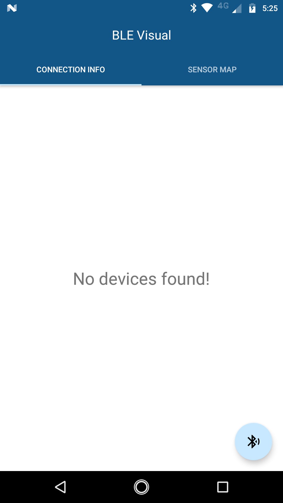
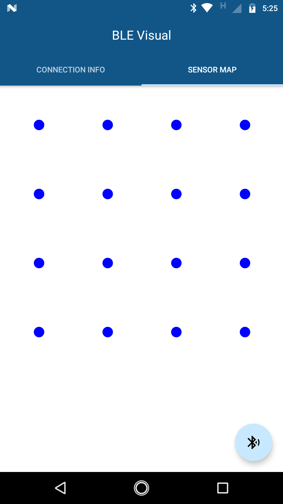
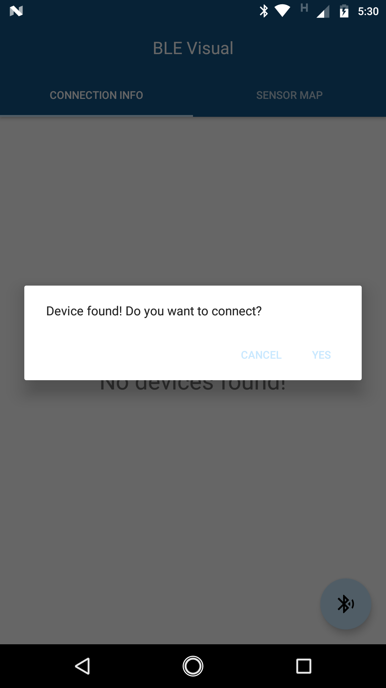
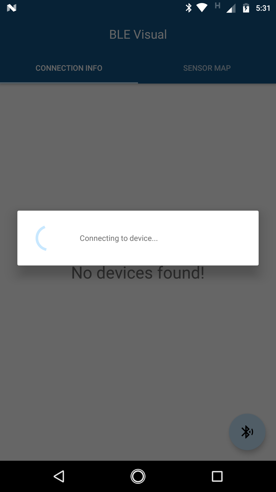
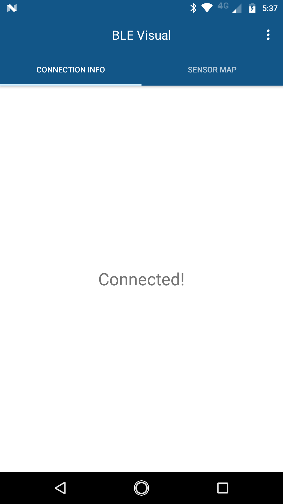
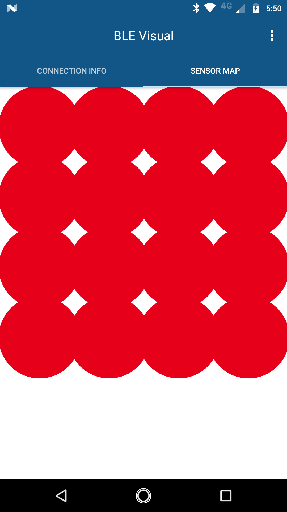
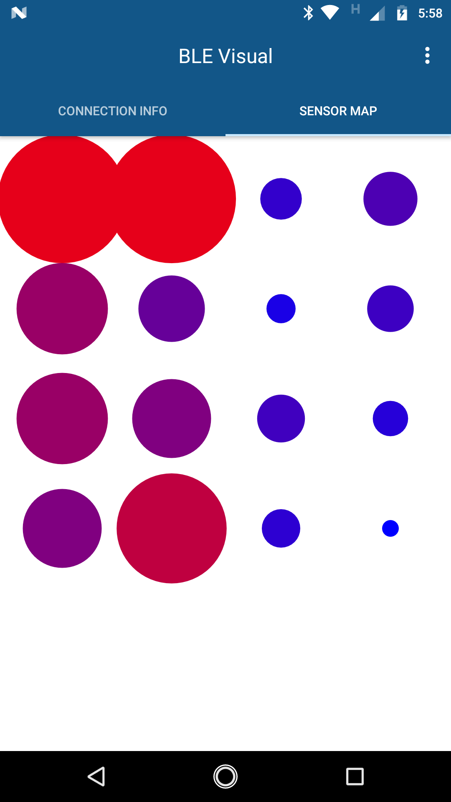
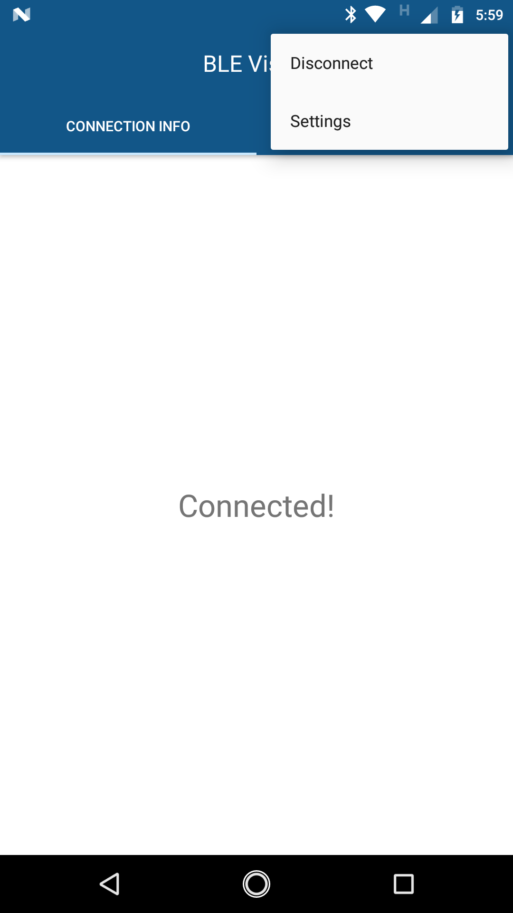

# BLE Visual

Android provides native support for Bluetooth Low Energy. 
This is a sample app which can make a BLE connection to a device and visualize the data of a 4x4 sensor array on the device
in the form of colored bubbles in real-time. 
 
 **Data Reading:** Low-Medium-High 
 **Bubble Color:** Blue-Purpe-Red 
 **Bubble Size:** Small-Medium-Large 

The app is designed with two swipable tabs. First tab displays connection information while the second displays the sensor map.
There is floating action button to initiate scan for devices. The app currently scans for maximum of 20 seconds to locate a 
device. When connected to a device, the sensor map updates in real time. In order to disconnect from the device, use the 
options menu. 

### BLE logic flow
1. Scan
2. Connect
3. Discover services
4. Request MTU
5. Set characteristic notification
6. Write to client configuration descriptor
7. Read data from characteristic

**Note:** This flow can be customized depending on the use case and device parameters. 
Some Android devices have a default MTU limit of 20 bytes hence, it is better to request for increased MTU for successful 
readings. 

**Requirements:** In order to run the app for this niche use case, enter custom UUIDs and Device Name in the Constants file. 
Otherwise the app runs using dummy UUIDs and empty Device Name.

Here are some sample screenshots of app workflow including sample sensor maps with all low, all high and random data 
values.  

  
  
  
  
  
   

### Future TODOs
1. UI improvements
2. Display more device information
3. Populate settings for app
4. Cleaner segregated code for MainActivity and BLEService
5. Generic logic for BLEService
6. Performance optimization
7. Unit tests
8. Generic BLE connection library

### Resources
1. [Android Developer Guide to BLE](https://developer.android.com/guide/topics/connectivity/bluetooth-le.html)
2. [BLE Beginner's Tutorial](https://devzone.nordicsemi.com/tutorials/b/bluetooth-low-energy/posts/ble-characteristics-a-beginners-tutorial)
3. [Android Bluetooth GATT API](https://developer.android.com/reference/android/bluetooth/BluetoothGatt.html)
4. [Bluetooth specifications guide](https://www.bluetooth.com/specifications)
